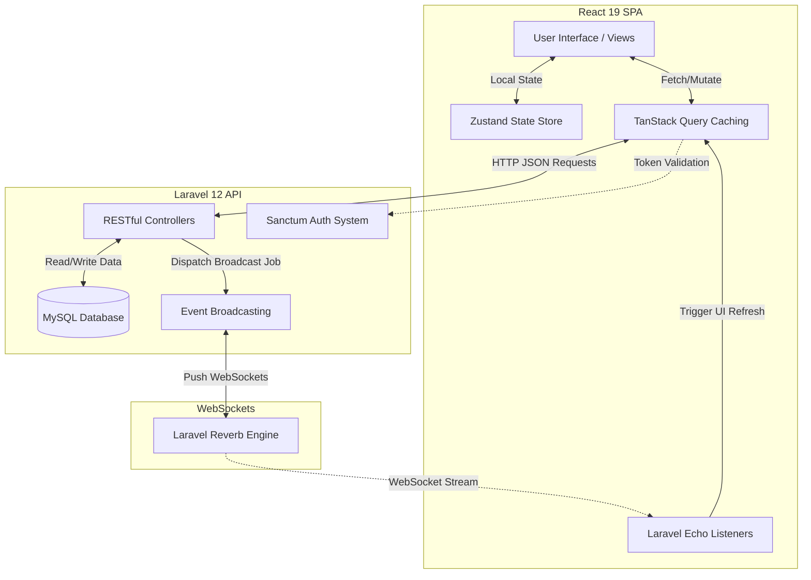

# Chirp 🐦 - Modern Social Media Platform


**Chirp** is a premium, feature-rich social media application inspired by Twitter/X. Built with a focus on speed, aesthetics, and real-time interaction, it provides a seamless user experience for sharing thoughts, media, and connecting with others.

## 🛠️ Technology Stack

Our platform leverages a modern, decoupled full-stack architecture:

### Frontend (Client-side)
- **React 19**: Modern UI library with the latest Concurrent features.
- **Vite**: Ultra-fast build tool and development server.
- **Zustand**: Lightweight, high-performance state management for UI and Auth.
- **TanStack Query (v5)**: Efficient server-state management, data fetching, and caching.
- **Tailwind CSS**: Premium, utility-first styling utilizing a "True Black" theme mimicking Twitter/X design.
- **Lucide React**: Clean, consistent icon set.

### Backend (API & Real-time)
- **Laravel 12**: Robust PHP framework serving as the underlying RESTful API.
- **Laravel Sanctum**: Secure, stateful token-based authentication.
- **Laravel Reverb**: High-performance first-party WebSocket server for instant data delivery.
- **MySQL**: Relational database for scalable data persistence.

---

## 📖 Comprehensive User Guide

Chirp is designed to be intuitive. Here is a step-by-step guide to using the core features:

### General Users
1. **Authentication:** 
   - **Register**: Navigate to `/register` to create a new account.
   - **Login**: Existing users can sign in at `/login`.
2. **Browsing the Timeline:** 
   - The `/home` page displays chronological posts from users you follow.
   - The `/explore` page allows you to discover trending hashtags, popular posts, and suggested users.
3. **Creating Content:** 
   - Use the "What's happening?" composer at the top of your timeline.
   - Type your thoughts, click the **Image** icon to attach photos, and click **Post**.
4. **Engagement:**
   - **Like/Retweet**: Click the heart or retweet icon below any post.
   - **Reply**: Click the speech bubble to add a reply to a conversation thread.
   - **Bookmark**: Save interesting posts for later by clicking the bookmark icon. View them anytime via the navigation menu.
5. **Direct Messaging:**
   - Access `/messages` to start private chats.
   - Search for a user's handle to initiate a real-time, WebSocket-powered conversation.
6. **Profile Customization:**
   - Go to your profile (`/[username]`) and click **Edit Profile**.
   - Update your display name, bio, location, avatar, and banner image.

---

## 🛡️ Admin Dashboard Guide

Users with Admin privileges can access the secure backend management portal at `/admin`. 
*(Note: To generate a default admin account, run `php artisan db:seed --class=AdminSeeder` in the API directory. Login using `admin@chirp.com` | `admin123456`)*.

### 1. Overview & Analytics (Dashboard)
- Displays real-time platform statistics (Total Users, Active Users, Pending Reports).
- Contains an interactive **User Activity Today** chart, visualizing platform traffic.
- View a quick list of the most recent account registrations.

### 2. User Management
- Search, filter, and paginate through the entire user base.
- **Ban/Suspend**: Admins can issue permanent bans or temporary suspensions with custom reasons.
- Revoke bans or delete violating accounts entirely.

### 3. Content Moderation (Posts)
- Browse all user-generated tweets and replies in a responsive grid layout. The layout automatically expands (up to 6 columns) on ultra-wide screens to maximize viewport usage.
- Use the **Search Bar** to find specific text or flagged keywords.
- **Bulk Action**: Select multiple posts using the checkboxes, then click "Delete Selected" to mass-remove violating content.

### 4. Reports System
- Review user-generated reports against toxic content or spam profiles.
- Resolve tickets by taking action directly from the reports menu (e.g., dismiss report, delete the reported post, or penalize the user).

### 5. Security Audit Logs
- Every administrative action (bans, post deletions, report resolutions) is logged immutably.
- View the audit trail to track which admin performed what action, targeting which user, at what exact timestamp.

---

## 🔄 App Workflow & Data Flow

Chirp utilizes an API-driven architecture where the React frontend acts as an independent SPA (Single Page Application) communicating strictly via JSON with the Laravel backend.

1. **Initialization:** When the user accesses the frontend, Zustand checks local storage for a valid Sanctum authentication token to restore the session securely.
2. **Data Fetching:** TanStack Query handles all outbound requests to the Laravel API via Axios. It aggressively caches data like the Home Timeline and User Profiles to eliminate redundant loading screens and provide a snappy, native-like experience.
3. **Real-time Engine:** Upon successful login, Laravel Echo establishing a connection to the Laravel Reverb WebSocket server. It listens to private channels (e.g., `user.{id}.notifications`, `user.{id}.messages`) to intercept events pushed dynamically from the Laravel backend payload.
4. **Mutations:** When a user interacts (e.g., likes a tweet, posts a reply), TanStack Query executes an **optimistic UI update**—instantly rendering the visual state change to the user while smoothly synchronizing the actual data with the backend in the background.

---

## 📊 System Flowchart

Here is the architectural flowchart defining how the system objects interact throughout the application:



---

## 🚀 Getting Started

### Prerequisites
- PHP 8.2+
- Composer
- Node.js & npm
- MySQL / MariaDB

### Installation

1. **Clone the repository**
   ```bash
   git clone https://github.com/RissN/laravel-chirp.git
   cd chirp-fullstack
   ```

2. **Backend Setup**
   ```bash
   cd chirp-api
   composer install
   cp .env.example .env
   php artisan key:generate
   ```
   *Configure your database settings in `.env` then:*
   ```bash
   php artisan migrate --seed
   php artisan storage:link
   ```

3. **Frontend Setup**
   ```bash
   cd ../chirp-frontend
   npm install
   ```

### 🌱 Database Seeding

Aplikasi ini dilengkapi dengan beberapa seeder untuk mengisi database dengan data pengujian. **Pastikan Anda berada di dalam direktori `chirp-api`** sebelum menjalankan perintah berikut.

1. **Admin Seeder**
   Digunakan untuk membuat akun super admin agar Anda bisa mengakses portal dashboard `/admin`.
   ```bash
   php artisan db:seed --class=AdminSeeder
   ```
   *Kredensial Login:*
   - **Email:** `admin@chirp.com`
   - **Password:** `admin123456`

2. **Mass Data Seeder**
   Digunakan untuk menghasilkan data tiruan dalam jumlah besar yang realistis (~600 pengguna, ribuan tweet, balasan, likes, follows, dan bookmarks) untuk menguji performa dan tampilan UI.
   ```bash
   php artisan db:seed --class=MassDataSeeder
   ```
   *Catatan: Semua akun pengguna dummy yang dihasilkan akan menggunakan password: `password`.*

### Running the Application

For the application to function correctly with real-time features, you must run all three of the following commands in separate terminal windows:

1. **Start Backend API Server**
   ```bash
   # In chirp-api
   php artisan serve
   ```

2. **Start WebSocket Server**
   ```bash
   # In chirp-api
   php artisan reverb:start
   ```

3. **Start Frontend Dev Server**
   ```bash
   # In chirp-frontend
   npm run dev
   ```

---

## 🛡️ License
Distributed under the MIT License. See `LICENSE` for more information.

## 🤝 Contributing
Contributions are what make the open-source community such an amazing place to learn, inspire, and create. Any contributions you make are **greatly appreciated**.

---
*Built with ❤️ by Antigravity*
