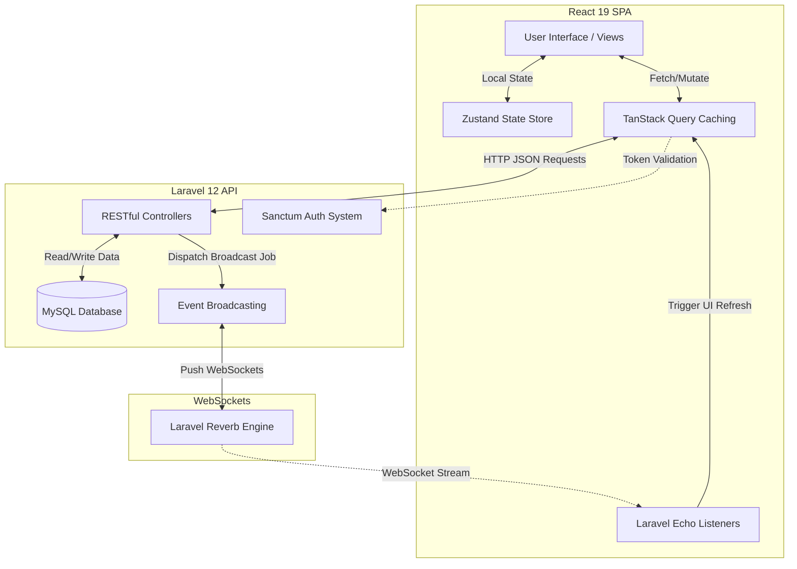

# Chirp 🐦 - Modern Social Media Platform


**Chirp** is a premium, feature-rich social media application inspired by Twitter/X. Built with a focus on speed, aesthetics, and real-time interaction, it provides a seamless user experience for sharing thoughts, media, and connecting with others.

## 🛠️ Technology Stack

Our platform leverages a modern, decoupled full-stack architecture:

### Frontend (Client-side)
- **React 19**: Modern UI library with the latest Concurrent features.
- **Vite**: Ultra-fast build tool and development server.
- **Zustand**: Lightweight, high-performance state management for UI and Auth.
- **TanStack Query (v5)**: Efficient server-state management, data fetching, and caching.
- **Tailwind CSS**: Premium, utility-first styling utilizing a "True Black" theme mimicking Twitter/X design.
- **Lucide React**: Clean, consistent icon set.

### Backend (API & Real-time)
- **Laravel 12**: Robust PHP framework serving as the underlying RESTful API.
- **Laravel Sanctum**: Secure, stateful token-based authentication.
- **Laravel Reverb**: High-performance first-party WebSocket server for instant data delivery.
- **MySQL**: Relational database for scalable data persistence.

---

## 📖 How to Use the Website

Chirp is designed to be intuitive and familiar to those who use modern micro-blogging platforms like Twitter.

1. **Authentication:** Start by creating an account via the stylish `/register` page or log in at `/login`.
2. **Posting a Tweet:** Navigate to `/home` and utilize the "What's happening?" composer. You can attach media and write your thoughts. Click "Post" to broadcast it to the platform.
3. **Interacting:** Click on any tweet to view its details. You can reply, like, or retweet. Inline replies load dynamically without refreshing the page.
4. **Direct Messaging:** Head over to `/messages`. You can search for other registered users and engage in real-time, private conversations (`/messages/{id}`). Unread indicators will notify you of new messages instantly.
5. **Customization:** Visit your profile (`/[username]`) to update your avatar, cover photo, bio, and other personal details. Toggle "Dark/Light Mode" using the sidebar menu to match your screen preference.
6. **Administration:** If you hold admin privileges, access the admin panel at `/admin` to view platform statistics, moderate user content, review reports, and manage user bans or suspensions.

---

## 🔄 App Workflow & Data Flow

Chirp utilizes an API-driven architecture where the React frontend acts as an independent SPA (Single Page Application) communicating strictly via JSON with the Laravel backend.

1. **Initialization:** When the user accesses the frontend, Zustand checks local storage for a valid Sanctum authentication token to restore the session securely.
2. **Data Fetching:** TanStack Query handles all outbound requests to the Laravel API via Axios. It aggressively caches data like the Home Timeline and User Profiles to eliminate redundant loading screens and provide a snappy, native-like experience.
3. **Real-time Engine:** Upon successful login, Laravel Echo establishing a connection to the Laravel Reverb WebSocket server. It listens to private channels (e.g., `user.{id}.notifications`, `user.{id}.messages`) to intercept events pushed dynamically from the Laravel backend payload.
4. **Mutations:** When a user interacts (e.g., likes a tweet, posts a reply), TanStack Query executes an **optimistic UI update**—instantly rendering the visual state change to the user while smoothly synchronizing the actual data with the backend in the background.

---

## 📊 System Flowchart

Here is the architectural flowchart defining how the system objects interact throughout the application:



---

## 🚀 Getting Started

### Prerequisites
- PHP 8.2+
- Composer
- Node.js & npm
- MySQL / MariaDB

### Installation

1. **Clone the repository**
   ```bash
   git clone https://github.com/RissN/laravel-chirp.git
   cd chirp-fullstack
   ```

2. **Backend Setup**
   ```bash
   cd chirp-api
   composer install
   cp .env.example .env
   php artisan key:generate
   ```
   *Configure your database settings in `.env` then:*
   ```bash
   php artisan migrate --seed
   php artisan storage:link
   ```

3. **Frontend Setup**
   ```bash
   cd ../chirp-frontend
   npm install
   ```

### Running the Application

For the application to function correctly with real-time features, you must run all three of the following commands in separate terminal windows:

1. **Start Backend API Server**
   ```bash
   # In chirp-api
   php artisan serve
   ```

2. **Start WebSocket Server**
   ```bash
   # In chirp-api
   php artisan reverb:start
   ```

3. **Start Frontend Dev Server**
   ```bash
   # In chirp-frontend
   npm run dev
   ```

---

## 🛡️ License
Distributed under the MIT License. See `LICENSE` for more information.

## 🤝 Contributing
Contributions are what make the open-source community such an amazing place to learn, inspire, and create. Any contributions you make are **greatly appreciated**.

---
*Built with ❤️ by Antigravity*
